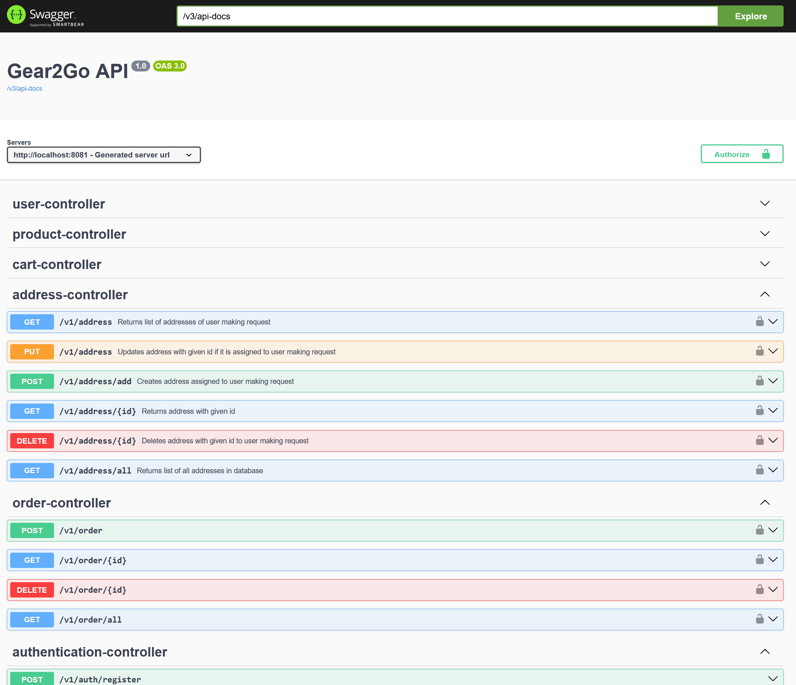

# Gear2Go

Goal of this project is to provide users easy access for renting outdoor gear.
The project consists of two repositories: Gear2Go (this one) - backend layer - and Gear2Go-Frontend ([Link](https://github.com/KayakOnWheels/Gear2Go_frontend)) - which is frontend 
layer build with Vaadin.
Keep in mind frontend layer is mainly to help visualize and test functionalities from user perspective, so it may not look as good as it could.  

---

## Main Features
- endpoints secured with JWT and roles.
- users can register, login,
- choose product for given date range and
- place order
- and recover password if one forget it.
- test coverage should be at least over 60% (in work)
- connectivity with external payment api (to do)

---

# Api Documentation
Api documentation is made with help of Swagger available at http://localhost:8081/swagger-ui

---

## Database Schema
